# ABOUT ME

## Who am I?
Hello Wprld! I am **Pranav Vyas**. I am a Data enthusiast having hands on experience in Project management, Data management and Data analysis. Recently completed Google Data Analytics professional certificate. Committed to get desired results using strategic planning and fast execution using limited sources.

## Courses & Certificates

### (1) Google Data Analytics

- Completed extensive 6 months job ready Google Career certification training. Demonstrated hands-on experience with data cleaning, data visualization project management, interpreting and communication data analytics findings. Confidence in transforming complex data into actionable and clear insights. Fluency in computer programming languages and a solid understanding of databases
- [Click here for certificate](https://coursera.org/share/f5a42af59e5feecfc27a2c0638d9f867)

### (2) TapRooT© Cause Analysis Training (2 days)

- Learned systematic techniques (SnapCharT©, TapRooT Cause Tree, Causal Factors) for identifying underlying causes of workplace incidents and improving safety and performance.
- [Click here for certificate](https://drive.google.com/file/d/1hOd6FAYq9KduJw4qELsoE58Bh-ypJEAv/view?usp=sharing)

### (3) Introduction to Power BI

- Gained practical experience in creating interactive dashboards and reports. Developed skills in data transformation, visualization and connecting various data sources to provide business insights.

- [Click here for certificate, simplilearn android app required from playstore for verfification](https://simpli.app.link/cwRXeBTppNb)

### (4) Google India Scholarship | Android Developer Nanodegree & Android Associate Developer Certificate

- Selected in 115 participants nationwide for 6 months Android Developer Nanodegree
- Completed Udacity's Android Nanodegree, gaining proficiency in building scalable, user-friendly Android applications with tools like Java, Android Studio, and Firebase, and implementing core concepts like UI/UX design, app architecture, and database management.
- Earned the Google Associate Android Developer Certification (Java version), demonstrating proficiency in building, testing, and debugging Android applications. Gained expertise in key Android development concepts including UI design, data storage, app lifecycle, and Java programming.
- [Click here for certificate](www.udacity.com/certificate/e/f4484d4a-6270-11e8-8ed8-23f39765e586)

## Projects
## [Click Here To See All Projects Done By Me](projects.md)

## Skills
- Adaptability
- Leadership
- Project management
- Data collection, cleaning  and analysis
- Database operations
- Programming languages used:
    - C
    - Java
    - VBA
    - SQL
    - R
- Software used: 
    - Microsoft Office
    - BigQuery
    - Power BI
    - Tableau
    - Kaggle
    - R Studio
    - Android Studio
    - ASPEN Process Explorer
    - MiniTab
    - GitHub
    - Firebase/Firestore

## Work Experience

**(1) Assistant Manager, Unit Technical Cell**

* **From**: January, 2022 to Till date
* **Location**: Grasim Cellulosic Division, Vilayat, Gujarat
* **Company**: Grasim Industries Pvt Ltd (Aditya Birla Group)

- Making and managing database for incidents information and recommendations for IISC. Making and presenting monthly review PPTs for Business IISC and Unit IISC
- Making daily and monthly reports of Water consumption, Caustic parameters and Performance reports for publishing with stockholders across plants in India, China, Indonesia & Thailand
- Managing 50+ WBSs’ budgeting having total value of 173 Crore. Helping department in successfully and seamlessly executing improvement and expansion schemes. Keep a close watch on commitment, spent and available budgets
- Data analysis from Unit Technical Cell side to find out RCAs for major problems happening in process departments
- New technology development and implementation to increase efficiency and/or reduce COP
Achieved water saving if 720 m3/day and increased salt recovery by 36 TPD by managing project as Project Owner of Sharplex Filtration System
- Successfully increased caustic availability from 19 hours to 188 hours by expansion of storage by 4400 m3 by coordinating with contractors and various departments
- Achieved effluent reduction by 320 m3/day by using Sharplex filtration system in SRU. Developed logic sequences having 14 valves and 96 steps by coordination with other units and vendors
- Increased sulfur recovery by EDTA effluent acidification Plant by coordination with team and achieving lowest approval to commissioning  time unit
- Acted as in-charge and ramp up production from 1100 kg/day to 1540 kg/day by establishing workflow and manpower management in Liva Reviva,  Nagda. Optimized logistics workflow to deliver raw material on time to Vilayat
- Increased hypo availabilty from 19 hours to 59 hours by increasing storage capacity from 60 m3 to 160 m3
- Participated in commissioning team of 14 Million Liters per Day capacity RO Plant

**(2) Graduate Engineer Trainee**

* **From**: January, 2021 to December, 2022
* **Location**: Steple Fiber Division, Nagda, Madhya Pradesh
* **Company**: Grasim Industries Pvt Ltd (Aditya Birla Group)

- Learned about fiber making process from pulp
- Visited customer units that uses fiber to make cloths to understand in depth process of supply chain
- Worked in commissioning of India's first VSF Zero Liquid Discharge Plant
- Completed Project on optimization of chemicals in Zero Liquid Discharge

## Hobbies:
- Photography
- Content Watching
- Traveling [Instagram] (https://www.instagram.com/pranav.vyas.99/)

## Achievements:
- Lead “Team Entropy” in Quality Circle competition to win **State level Gold Medal** and **National level Gold Medal (Par Excellence Award)** [Certificate here](https://drive.google.com/file/d/1pqpcwVgqoSmpxf5jXdAYJDukUYHGsvsN/view?usp=sharing)
- Total 6 iApplaud recognition received in excellence in work category
- GATE 2020 AIR: **1296** ; GATE 2021 AIR: **746** [Certificate here](https://drive.google.com/file/d/1pdeKT7AEZxlX0ilV52i9CjdZjVD4jUZi/view?usp=sharing)
- Successfully organized event Backyard science in Pshiphon 3.0 (ChES, SVNIT’s yearly event) 
- 1st rank in T-Issue in Siphon 2016 (Certificate here)
- Participated **ICPC-2016 and DotSlash Hackathon 2.0**
- 1st rank in IT Quiz by TCE in 2012 [Certificate here](https://drive.google.com/file/d/1y70hDfwaPj-VRVuLNXboVB0kFKhLCAOM/view?usp=sharing) & 2013 (District Level) [Certificate here](https://drive.google.com/file/d/1JZ50U41WvzKWBd_ahUQMPTDnOFYZx9yD/view?usp=sharing)
- AIR 7 in “Bhasker Genius Test” by Divya Bhasker [Certificate here](https://drive.google.com/file/d/1pharK6QnempBnCiX5xYye-boN-jPdDWO/view?usp=sharing)
- 2nd rank in classical singing (District)

## Ways to connect with me

- [Gmail : pranavvyas4399@gmail.com](https://mail.google.com/mail/?view=cm&fs=1&tf=1&to=pranavvyas4399@gmail.com)
- [GitHub : PranavVyas](https://github.com/PranavVyas)
- [LinkedIn : Pranav Vyas](https://in.linkedin.com/in/pranav-vyas-51bb4a1a8)
- [Medium : Pranav Vyas](https://medium.com/@pranav.vyas.99)

<!-- ## (1) Google Data Analytics Capstone Project

> I started this case study as a Capstone Project of Google Data analytics Proffesional Certificate.

### Overview

- Completed a capstone project for Cyclistic bike-share company, analyzing user data.
- Focused on understanding differences between casual riders and annual members.
- Used SQL, BigQuery, and PowerBI for data cleaning, analysis, and visualization.
- Identified patterns in rider behavior, such as ride times and locations.
- Provided actionable marketing recommendations to increase annual memberships.
- Emphasized data integrity, ensuring that records were error-free after cleaning.
- Final insights aimed at helping the marketing team optimize campaigns and boost conversion rates.

### Screenshots

Here are some of the visuals created for the project: To read about the project [Click here][GDACapstoneArt]

Monthwise Rider types Graph:
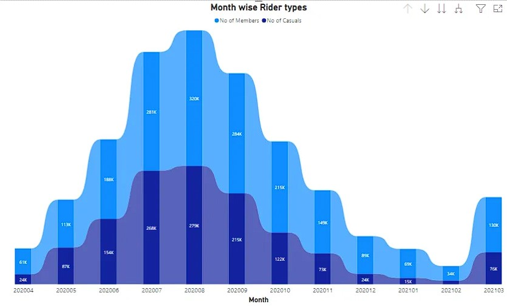

Weekdaywise Rider types Graph:
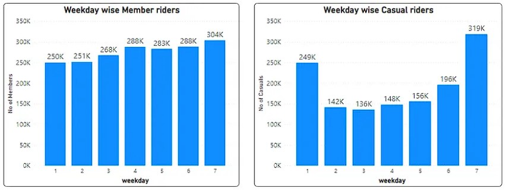

### Download Links

| Sr No |  Perticular | Detail |
| ------ | ------ | ------ |
| 1 | Project End Date | September, 2024|
| 2 | Status | Completed |
| 3 | Update | Not maintained |
| 4 | Microsoft PPT | [Click here][GDACapstonePPT] |
| 5 | Report PDF | [Click here][GDACapstoneRpt] |
| 6 | Explaination Article | [Click here][GDACapstoneArt] |
| 7 | GitHub Link | [Click here][GDACapstoneGitHub] |

## (2) CCTV Monitering Dashboard

### Background:

- I started this project as a self initiative. I was incharge of CCTV monitering data (There was practise of HODs oberving cctv cameras and seding theirobservations via email to me, I then kept record in local excel file). This became hard to maintain as SHs are also involved later, which increased observer numbers and thus mails.
- So, I created microsoft power app to get details from HODs and SHs
- I have taken feedback from my stackholders (VP-Production, VP-Engineering, DH-Safety, LH-Technical Services) for details required to be filled in form (I had to read every observation and put in different 9 categories, now i have added this in form so manual reading of observation is also avoided)
- After I received enough data, I started with making dashboard in PowerBI. I deveoped dashboard and deployed on company server. This gave us what are most observed violations and helped by creating action plan for reduction

### Overview

- Data collection from section heads and above about observation done through CCTV of unsafe act
- Designed database, identified requirements and created forms for online data collection accessible from Phone or Web browser
- Categorized in 9 different categories and generate recommendations based on observations
- Report format made after discussion of stakeholders and shared on weekly basis
- Made insightful dashboard in PowerBI to see and moniter KPIs

### Screenshots

Here are some of the screen shots of dashboard:

Xoxoxox:

XoxoX:

### Download Links

| Sr No |  Perticular | Detail |
| ------ | ------ | ------ |
| 1 | Project End Date | Continued since August,2024 |
| 2 | Status | Not completed |
| 3 | Update | Updated as required |
| 4 | GitHub Link | [Click here][CCTVGitHub] |

## (3) Student Companion Android App

> I started this app as a Capstone Project of Udacity's Android Developer Nanodegree, but continoued to develop and add features to it untill 2019. This project is not maintained by me now. Here is description of app:

Student Companion is an app that has many features that are useful for students in school, High School or college.

### Features

- **Attendance Manager**
    - Manages attendance and reminds you to fill attendance, This can be useful to see the regularity of student or in some colleges with minimum attendance criteria.
    - Overall attendace summary can be seen for each subject by going to Overall Attendance Manager
- **Smart attendance**
    - Marks attendance based on geo location of phone, If phone is in the location provided for classes, automatically attendance is marked. 
- **NoteManager** 
    - Notes can be taken easily and later be edited or removed as per convenience by Note Manager. 
- **Market place** 
    - Market place is made through this app to post ads about your old books, vehicles, documents so that other people can use them and both will get the benefit. As there is no payment gateway included with the app user does not need to fill any pieces of information other than phone no to contact.
- **Digital library**
    - This feature ensures that the student has enough material to study if they can not afford books they should use the digital versions.
- **The Notification Manager** 
    - Notification Manager will warn the user if attendance goes lower or if there is an interesting event going on in college!
- **Today's lecture Widget**
    - The widget provided with the app removes the headache of remembering the lectures by providing the lecture of that days right on the home screen. The widget will update at the midnight (around 12:00 AM) so it makes sure that you only see the latest day's timetable and also don't consume battery by frequently updating itself
- **Dark Theme (Available only in Paid Version)**
    - By Enabling the dark mode in the settings page you can use dark mode. Why us there Dark Mode ? Well It saves some battery on AMOLED Screens and main reason is It looks Cool 
- **Timetable & Holidays**
    - It is very easy to see time table of the whole week in the app. Just touch the hamburger menu (3 horizontal lines at top left corner) or swipe from left edge to right to open Navigation menu and than select timetable and you can see the timetable and select the holidays to see the holidays and details about holidays

### Screenshots

| Student Companion |
| ------ |
| 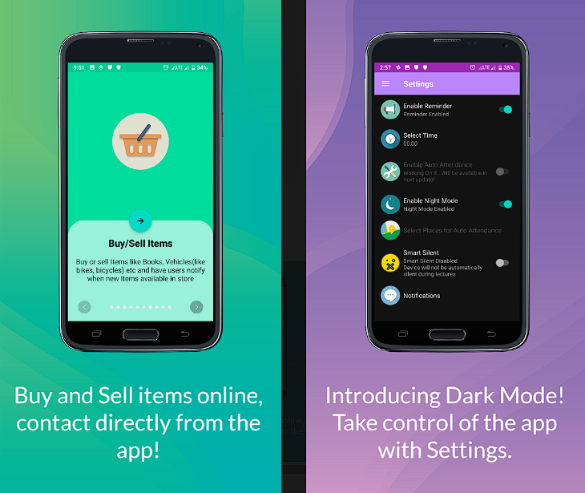 |
| 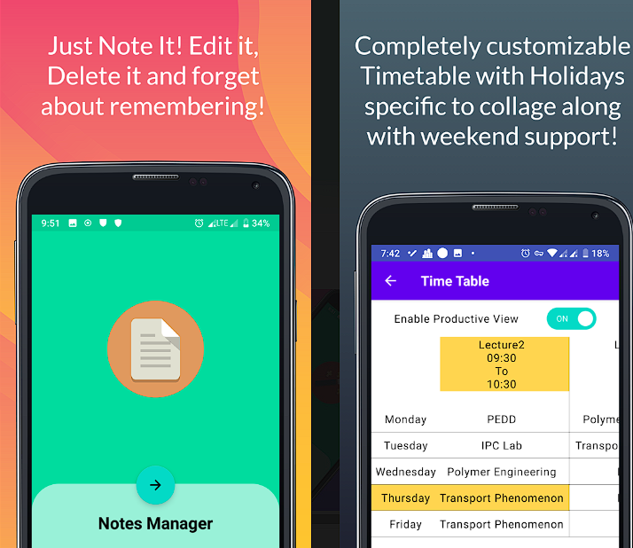 |
| 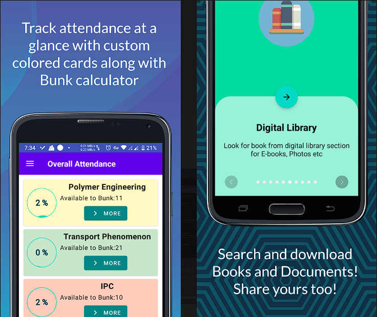 |
| 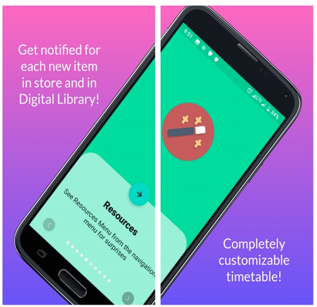 |
| 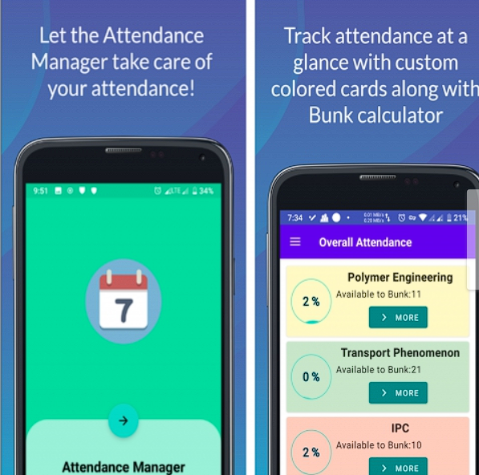 |

### Details

| Sr No |  Perticular | Detail |
| ------ | ------ | ------ |
| 1 | Project End Date | January, 2019|
| 2 | Status | Completed |
| 3 | Update | Not maintained |
| 4 | GitHub Link | [Click here][SCGitHub] |

## (4) Student Companion Android App (MVVM Based Version)

- Same as "Student Companion Android App" but built from ground up using Room Library and use of ViewModel Library to handle android life cycle data transitions

> This project is not maintained now, This was made as part of learning and development for MVVM architecture

### Details

| Sr No |  Perticular | Detail |
| ------ | ------ | ------ |
| 1 | Project End Date | November, 2019|
| 2 | Status | Completed |
| 3 | Update | Not maintained |
| 4 | GitHub Link | [Click here][SCMVVMGitHub] |

## (5) Movie Mania

> I created this app to learn about Room database and how to use API to fetch data. I created this app while I was learning android development from Udacity. This app is not maintained now. Feel free to checkout the source code and fork it and update it to your liking.

- Movie Mania is an app that is created with purpose of entertainment in mind.
- It provides features like Movie Details, Movie list sorted by popularity, IMDB Rating and New Movies Movie Details contains information like Movie trailer linked directly to YouTube and can be shared directly from the app at any time

### Screenshots

| 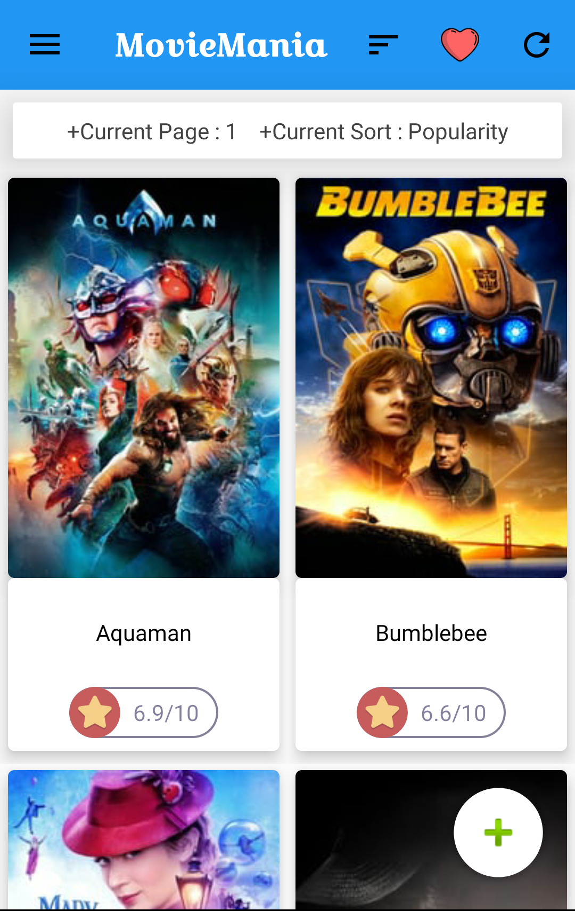 | 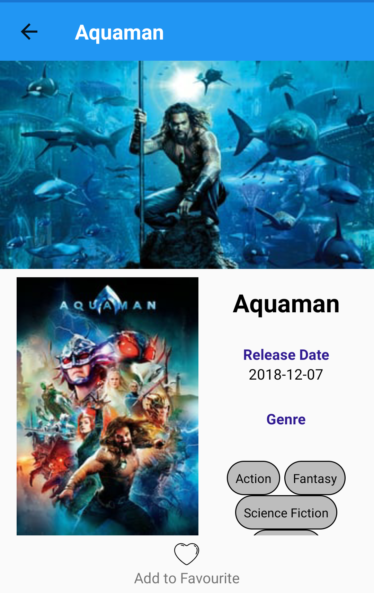 |
| ------ | ------ |
|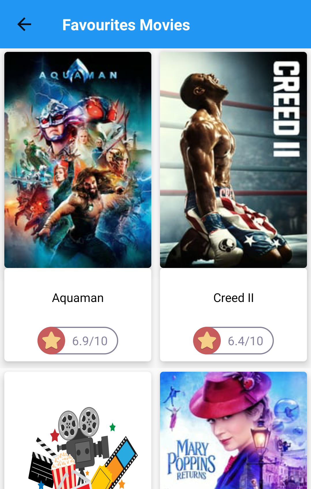 | 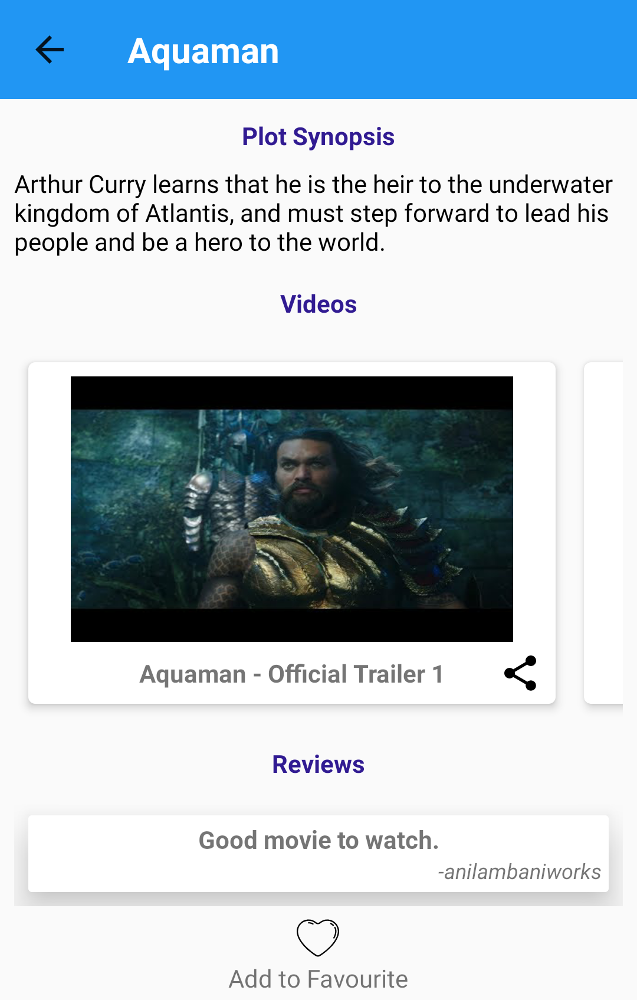 |

### Details

| Sr No |  Perticular | Detail |
| ------ | ------ | ------ |
| 1 | Project End Date | October, 2018|
| 2 | Status | Completed |
| 3 | Update | Not maintained |
| 4 | GitHub Link | [Click here][MMGitHub] |

### (6) XYZ Reader

> XYZ is a project done under Udacity Nanodegree Projects and redesigned app from the original app given by Udacity in the Nanodegree

- XYZ reader is feed reader app that uses Material Design Guidelines and new material design components for better UX to show very big articles at once in the app.
- The app is optimized by using recycler view to load text, in this way app stays efficient in memory and shows very big articles at once.
- The recycler view does not load all the items at once but recycles the item holders and caches them for further use, in this way the app uses very low memory (compared to normal list view or single text view) to load three articles each being more than 1000 lines from the internet!

### Details

| Sr No |  Perticular | Detail |
| ------ | ------ | ------ |
| 1 | Project End Date | October, 2018|
| 2 | Status | Completed |
| 3 | Update | Not maintained |
| 4 | GitHub Link | [Click here][XYZRGitHub] |

## (7) EasyEdu

> EasyEdu is app made in DotSlash 2.0 hackathon. We were two people team (**Team[0]** - Pranav Vyas, Tirth Patel), I focused on coding and my partner in creating visuals, wireframes etc. We made this app in 26 hours, so this might be looking like unfinished app, but functionally this is working fully

**Problem Statement:** 
- The country has always been striving to get education to the commons in the most lucrative way possible. Educational resources and measures to improve its discourse comes under the category.

**Solution:**
- A platform for University Students to share Documents such as Exam Papers and Study Material.
- Users can Upload/Download Documents shared by Users.
- Users can follow subjects, semesters and branches to receive updates when a new document is uploaded for that subject/semester/branch.
- Users can schedule reminders to downloads documents.

### Screenshots

| 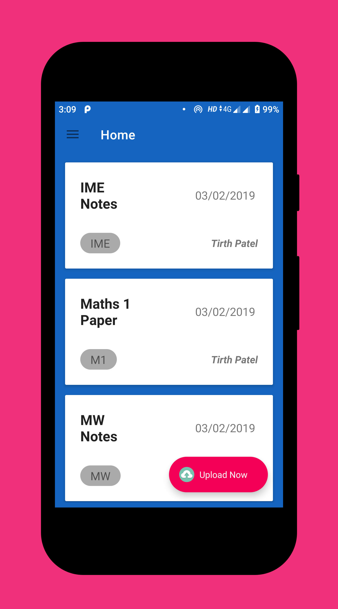 | 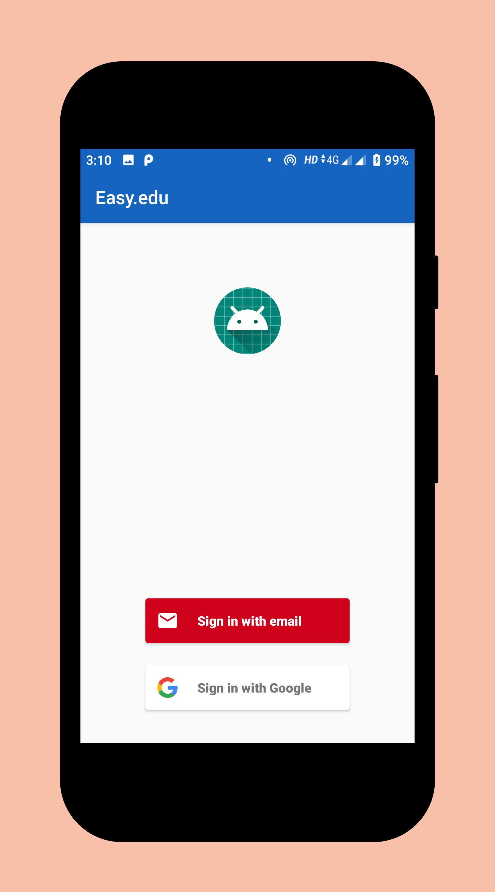 |
| ------ | ------ |
|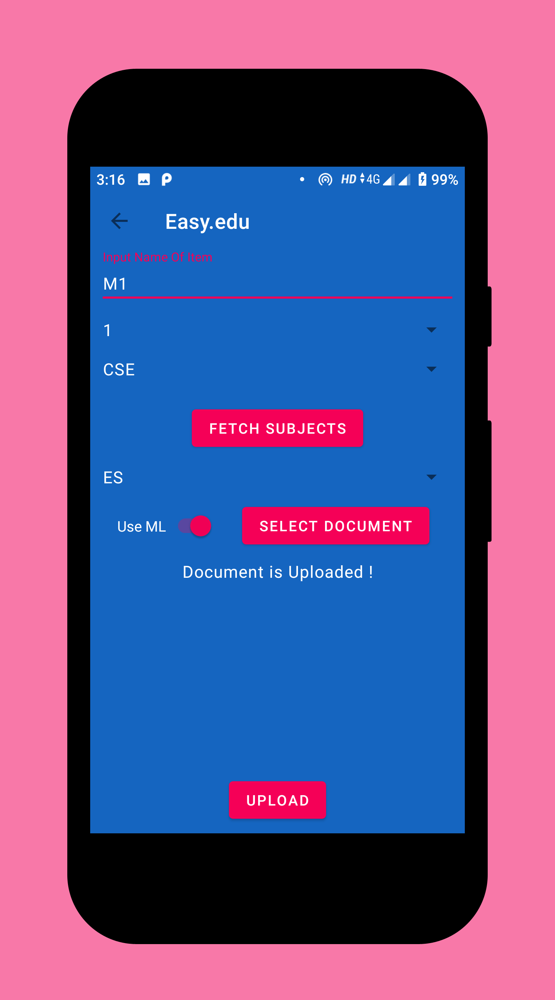 | 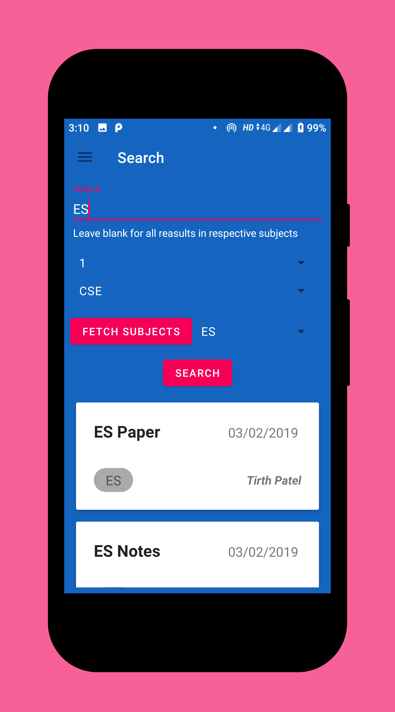 |
|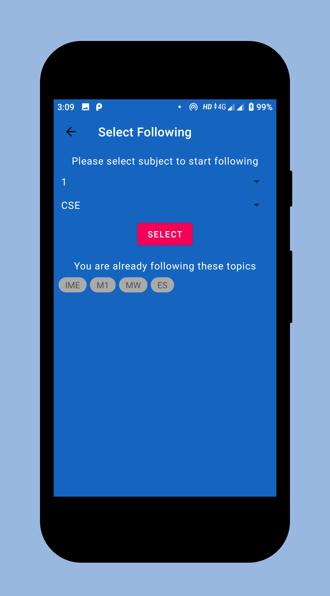 | 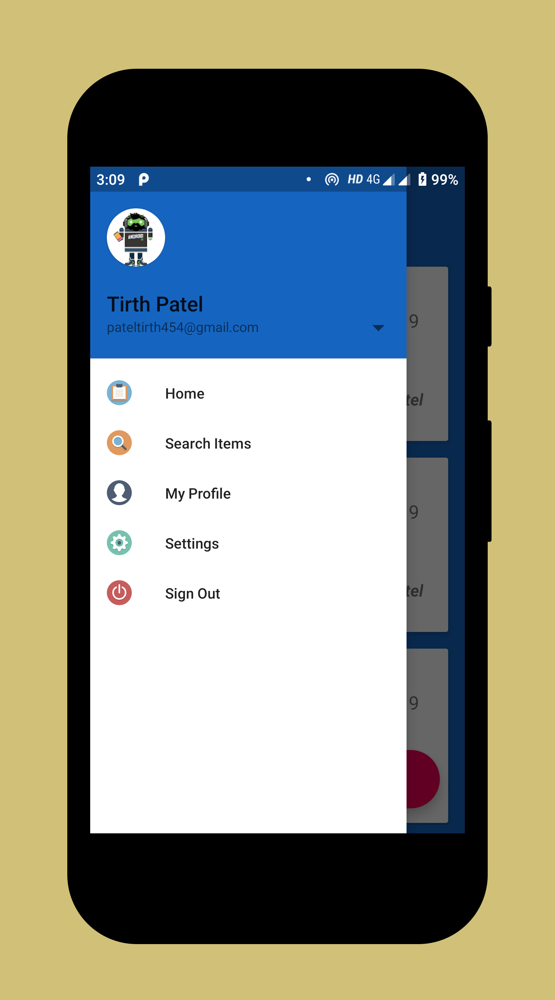 |

### Details

| Sr No |  Perticular | Detail |
| ------ | ------ | ------ |
| 1 | Project End Date | February , 2019|
| 2 | Status | Completed |
| 3 | Update | Not maintained |
| 4 | GitHub Link | [Click here][EEGitHub] |

## (8) My Cook Book

> My Cook Book is a project done under Udacity Nanodegree Projects. This project is not maitained by me anymore.

- My Cookbook is an android app to demonstrate the extraction of information from JSON file located in cloud and handling of various cases like unavailability of full information
- App also uses the ExoPlayer to buffer and show online video content to user with media controls that can be controlled by the various connected device like earphones, Bluetooth devices etc
- My Cookbook shows off some of the useful features like PIP Mode, Automatically Full Screen while in landscape mode

### Screenshots

| 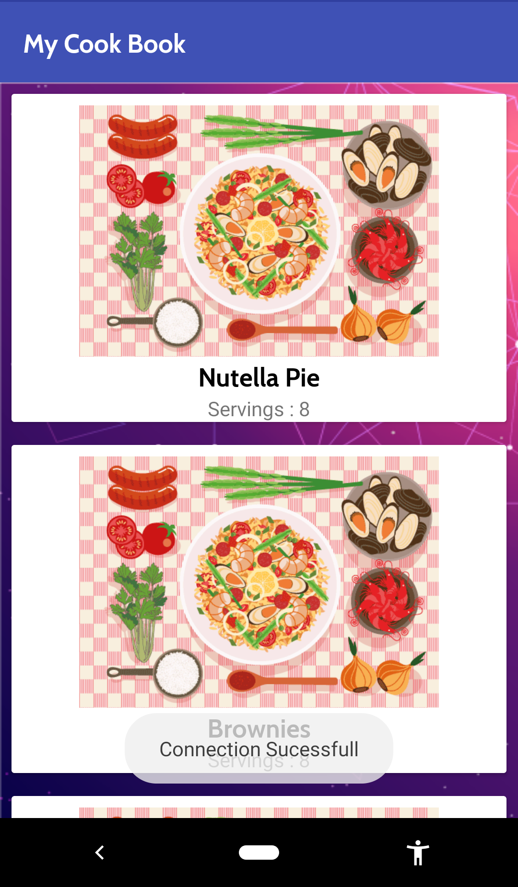 | 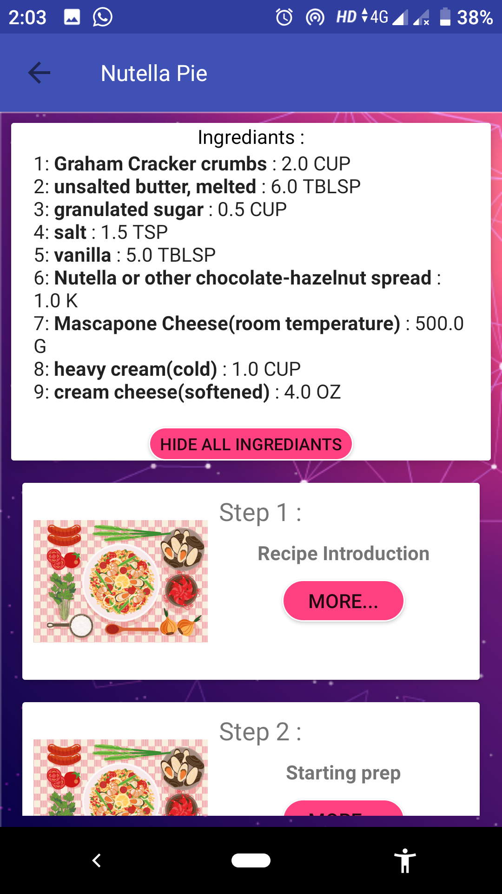 |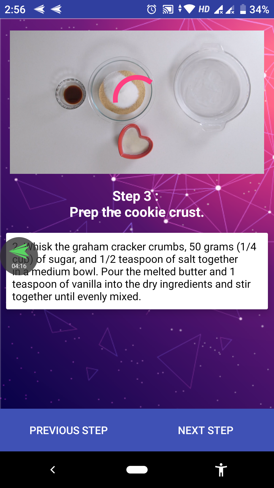 |
| ------ | ------ | ------ |
| Home Screen | Details Page | Video Page |

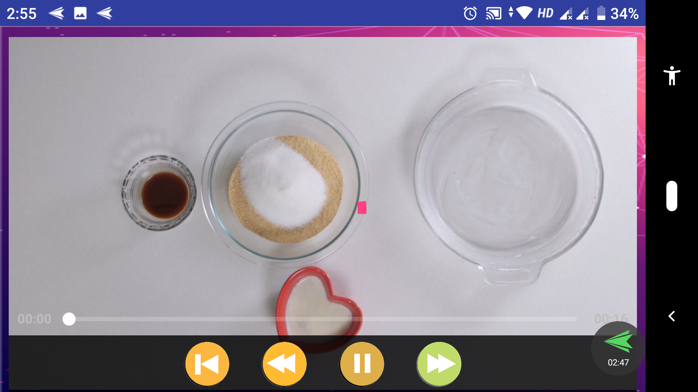

### Details

| Sr No |  Perticular | Detail |
| ------ | ------ | ------ |
| 1 | Project End Date | August, 2018|
| 2 | Status | Completed |
| 3 | Update | Not maintained |
| 4 | GitHub Link | [Click here][MCBGitHub] |

## Other Projects

> Other projects I have developed during Udacity Android Developer nanodegree, College and School time during extra time as a side projects. I have always been curious of something I have learnt that can be used to create something that is useful and unique. so, I always try to create something to implement core concepts I have learnt. After all, when we implement something we learn, we also find some of the unexpected challenges

## (9) Tic Tac Toe for Andoid

### Details

| Sr No |  Perticular | Detail |
| ------ | ------ | ------ |
| 1 | Project End Date | July, 2017|
| 2 | Status | Completed |
| 3 | Update | Not maintained |
| 4 | GitHub Link | [Click here][TTTAndroidGitHub] |

## (10) ProHotspot v2

### Details

| Sr No |  Perticular | Detail |
| ------ | ------ | ------ |
| 1 | Project End Date | 2017 |
| 2 | Status | Completed |
| 3 | Update | Not maintained |
| 4 | GitHub Link | [Click here][PHSV2GitHub] |

## (11) Tic Tac Toe (Java GUI Version)

> This is my first app made in Java GUI for practising and learning concepts. I used GUI elements for making this app

- Tic Tac Toe is a game which is played by two players, which is a very old game and here it is my best try to create the same game in Java language!!

### Screenshots

| 
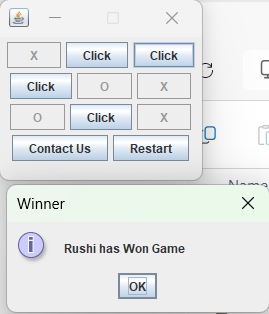
 |
| ----- |
| 
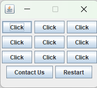
 |
| 
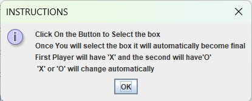
 |

### Details

| Sr No |  Perticular | Detail |
| ------ | ------ | ------ |
| 1 | Project End Date | 2016 |
| 2 | Status | Completed |
| 3 | Update | Not maintained |
| 4 | GitHub Link | [Click here][TTTJavaGitHub] |

## (12) Tic Tac Toe (C Language Version)

> This is my first every venture to programming and making "app" from coding

- Tic Tac Toe is a game which is played by two players, which is a very old game and here it is my best try to create the same game in Java as well as C language!!

### Screenshots

| Tic Tac Toe (C) |
| ------ |
| 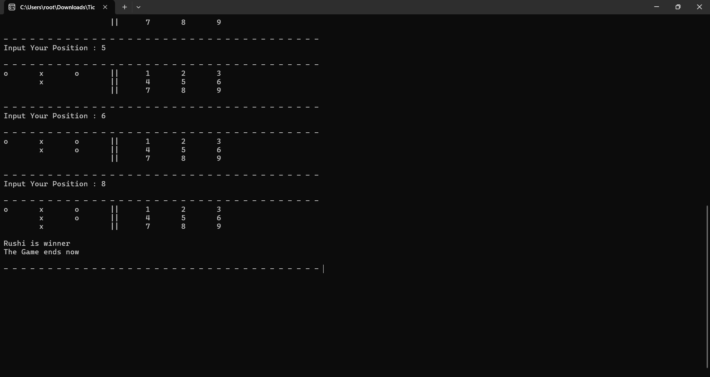 |
| 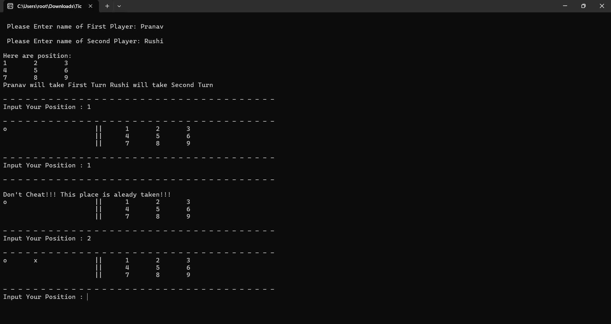 |
| 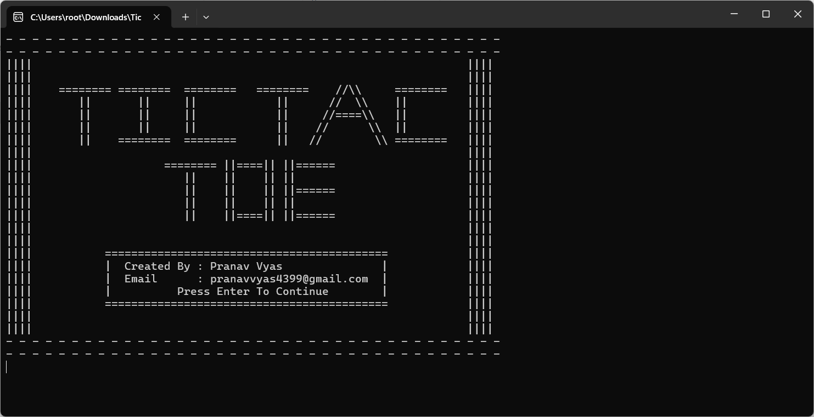 |

### Details

| Sr No |  Perticular | Detail |
| ------ | ------ | ------ |
| 1 | Project End Date | 2014 |
| 2 | Status | Completed |
| 3 | Update | Not maintained |
| 4 | GitHub Link | [Click here][TTTCGitHub] |

## (13) PAI

> This app was developed when we did not had computer in our house. We had extra curricular classes as Computer subject in my town in my school. I joined these classes and whenever I am doe with teachers assignment, I worked on this project and some other C projects. Please keep in mind that this is written by me back when Computers were not populer in my town and only my school had 10 computers in our whole town. I was just learning the computer languages. I wanted to have orignal program here so I did not changed anything 

- PAI is written in C language which is basically early database of sentences.
- I have incorporated trial and paid mode in this also, For paid version user can set password which is stored in "base.obb" file and for creating OTP is required which is generated through an algorithm.
- OTPs are stored in OTP.txt file that is generated by program
- Database is stored in "file.obb"
- If value is found it returns values if not found it asks for input answers you want to display and stores inside local file

### Screenshots

| PAI |
| ------ |
| 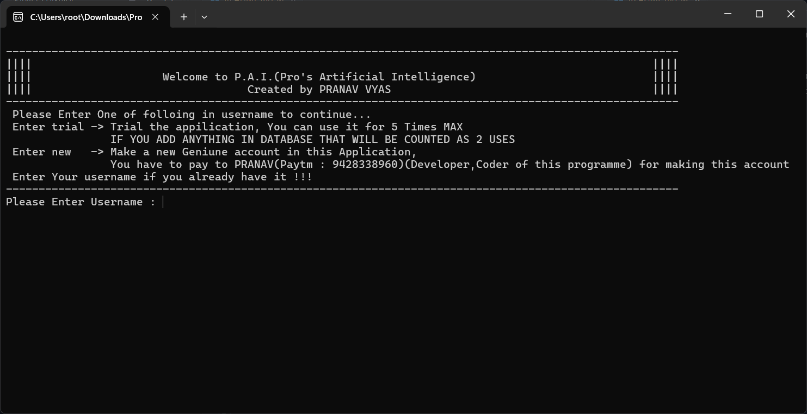 |
| 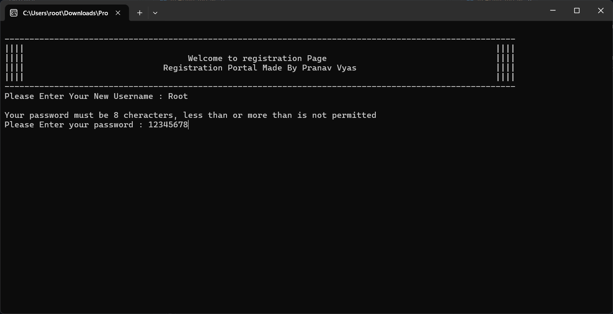 |
| 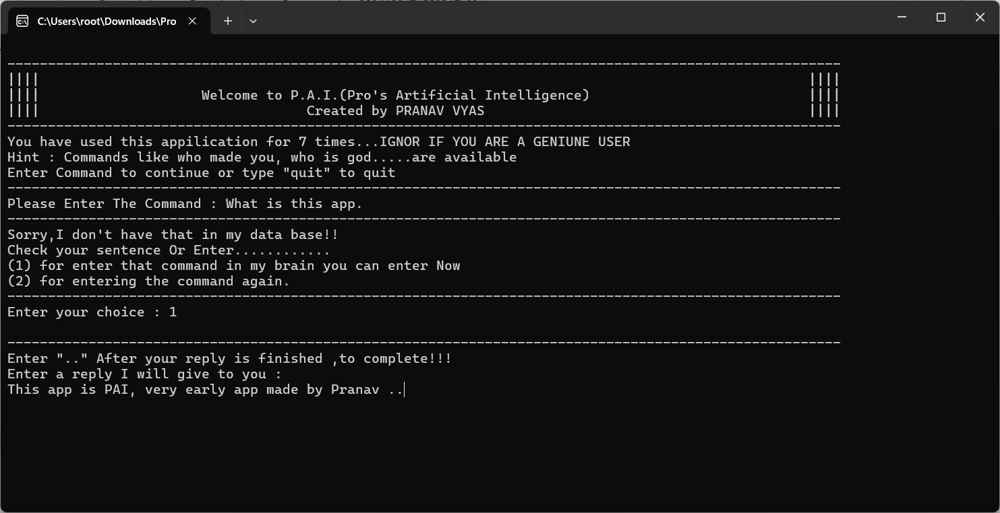 |

### Details

| Sr No |  Perticular | Detail |
| ------ | ------ | ------ |
| 1 | Project End Date | 2014 |
| 2 | Status | Completed |
| 3 | Update | Not maintained |
| 4 | GitHub Link | [Click here][PAIGitHub] |

## (14) PKV website

> If the graphics looks old but this was made by me in Microsoft App, I don't remeber exctely now. But it was in 2013 when I coded this website in my schools computer in computer classes. There are many things written in this website which might be looking childish, Because it was made by a child who used this thing called computer for 3-4 months in intervals. I wanted to keep this as is so nothing is changed.

This is a HTML file, in which programming is done for with IF ELSE.

### Details

| Sr No |  Perticular | Detail |
| ------ | ------ | ------ |
| 1 | Project End Date | 2013 |
| 2 | Status | Completed |
| 3 | Update | Not maintained |
| 4 | GitHub Link | [Click here][PKVGitHub] |

[GDACapstoneDsetOrg]: <https://github.com/PranavVyas/GDACapstone/tree/main/Databases/Original>
[GDACapstoneDsetClnd]: <https://github.com/PranavVyas/GDACapstone/tree/main/Databases/Cleaned>
[GDACapstoneGitHub]: <https://github.com/PranavVyas/GDACapstone>
[GDACapstonePPT]: <https://github.com/PranavVyas/GDACapstone/tree/main/Presentation>
[GDACapstoneRpt]: <https://github.com/PranavVyas/GDACapstone/tree/main/Report>
[GDACapstoneArt]: https://medium.com/@pranav.vyas.99/a-beginners-guide-to-google-data-analytics-capstone-project-how-does-a-bike-share-navigate-speedy-f4a04f701d4a
[MovieManaiaGitHubLink]: <https://github.com/joemccann/dillinger/tree/master/plugins/onedrive/README.md>
[ProfileGithub]: <https://github.com/joemccann/dillinger/tree/master/plugins/onedrive/README.md>
[ProfileLinkedIn]: <https://github.com/joemccann/dillinger/tree/master/plugins/onedrive/README.md>
[ProfileGmail]: <https://github.com/joemccann/dillinger/tree/master/plugins/onedrive/README.md>
[ProfileKaggle]: <https://github.com/joemccann/dillinger/tree/master/plugins/onedrive/README.md>
[ProfileMedium]: <https://github.com/joemccann/dillinger/tree/master/plugins/onedrive/README.md>
[SCGitHub]: <https://github.com/PranavVyas/StudentCompanion>
[SCMVVMGitHub]: <https://github.com/PranavVyas/StudentCompanionMVVM>
[MMGitHub]: <https://github.com/PranavVyas/PopularMovies>
[CCTVGitHub]: <https://github.com/PranavVyas/CCTVDashboard>
[XYZRGitHub]: <https://github.com/PranavVyas/XYZ-Reader>
[MCBGitHub]: <https://github.com/PranavVyas/MyCookBook>
[PAIGitHub]: <https://github.com/PranavVyas/PAI>
[PKVGitHub]: <https://github.com/PranavVyas/PKVWebsite>
[TTTJavaGitHub]: <https://github.com/PranavVyas/TicTacToe_Java>
[TTTCGitHub]: <https://github.com/PranavVyas/Tic-Tac-Toe>
[TTTAndroidGitHub]: <https://github.com/PranavVyas/TIcTacToeForAndroid>
[EEGitHub]: <https://github.com/PranavVyas/DotSlash>
[PHSV2GitHub]: <https://github.com/PranavVyas/DotSlash> -->